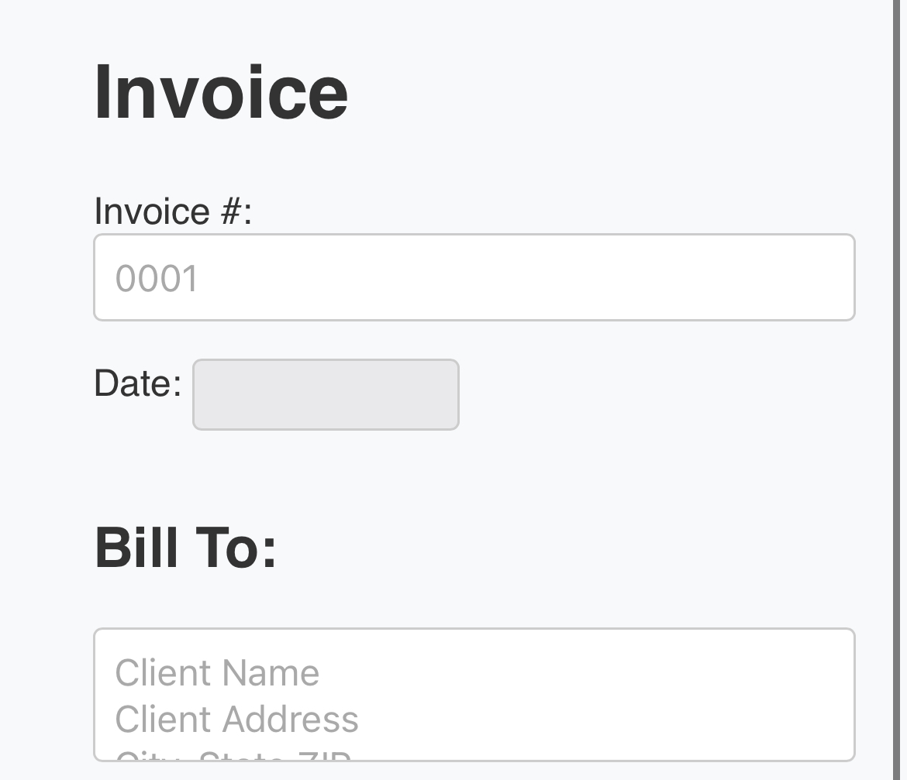

# 🧾 Invoice Generator Template

Create beautiful, responsive invoices directly in your browser — no backend, no setup, just open and use.

## ✨ Features

- 🧠 Smart line item calculations (quantity × price)
- ➕ Add unlimited invoice items
- 💡 Clean, modern UI with Inter font
- 🖨️ Print to PDF with browser print support
- ⚡ Works 100% offline

## 🚀 How to Use

1. **Clone or Download** this repo
2. Open `index.html` in your browser
3. Fill out your invoice details
4. Click "Print" or save as PDF

## 📁 File Structure
invoice-generator/
├── index.html     # Main HTML structure
├── style.css      # Styling (responsive + modern)
├── script.js      # Handles item logic & total calculation
├── preview.png    # Preview (Can Delete)

## 🛠 Tech Stack

- HTML5
- CSS3 (no frameworks)
- JavaScript (vanilla, no libraries)

## 📄 License

MIT — Free to use, modify, and distribute. Attribution appreciated but not required.

---

Made with 💜 by [Jorge Gonzalez](https://jorge.temporalai.tech)